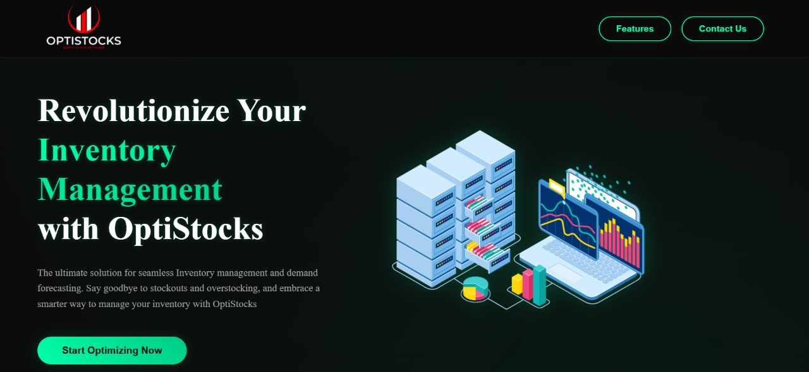
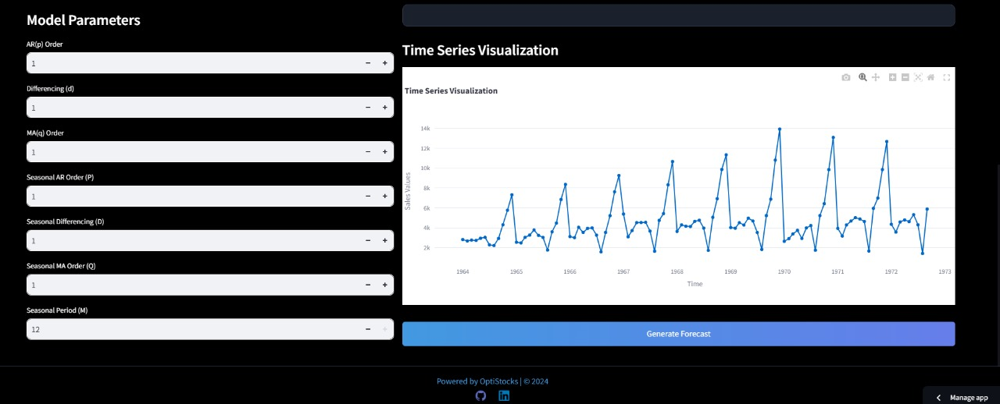

# OptiStocks 

## 🚀 Revolutionize Your Supply Chain Management

Welcome to **OptiStocks**, your all-in-one solution for inventory management, demand forecasting, and analytics. With a sleek interface, robust backend, and powerful machine learning models, OptiStocks makes managing your inventory a breeze. 

---

## 🌟 Key Features

### 📊 Real-Time Inventory Monitoring
Track inventory levels in real time with precise updates to ensure optimal stock availability.

### 📦 Streamlined Order Processing
Automate your purchase and sales orders, reducing manual tasks and minimizing errors.

### 📈 Comprehensive Analytics and Reporting
Get actionable insights with in-depth reports on sales trends, inventory status, and demand forecasting.

### 🔮 Demand Forecasting
Use advanced ARIMA and SARIMA models to predict customer demand and optimize inventory planning.

### 🤖 Machine Learning Models
Leverage powerful ML models deployed via **Streamlit** for forecasting and sales predictions.

### 📲 Twilio Integration
Stay updated with stock alerts and notifications via Twilio integration.

---

## 🛠️ Tech Stack

### Frontend
-   
- 
- 
- 
- 

### Backend
- 
- 

### Database
- 

### Machine Learning
- 
- 
- 
- 

### Deployment
- 

### Communication
- 

---

## 🖥️ Installation and Usage

### Prerequisites
- Node.js
- Python (for ML models)
- MongoDB

---

## 🖼️ UI Preview

| Feature               | Screenshot                 |
|-----------------------|----------------------------|
| Inventory Dashboard   |  |
| Forecasting Module    |   |

---

## 🤝 Connect with Me

  

---

## 📜 License

This project is licensed under the MIT License - see the [LICENSE](LICENSE) file for details.

---

### 💡 What We Bring to the Table?

**OptiStocks** combines cutting-edge technology with user-friendly features to streamline your inventory management processes. Start optimizing your supply chain today with **OptiStocks**! 🌟

 Visit **OptiStocks**, your all-in-one solution for inventory management, demand forecasting, and analytics. With a sleek interface, robust backend, and powerful machine learning models, OptiStocks makes managing your inventory a breeze.
